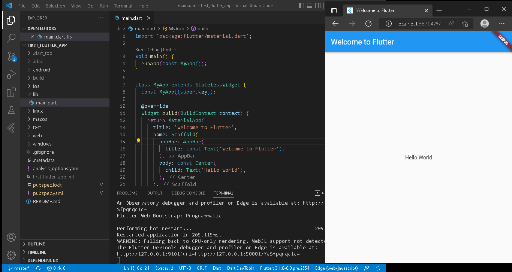
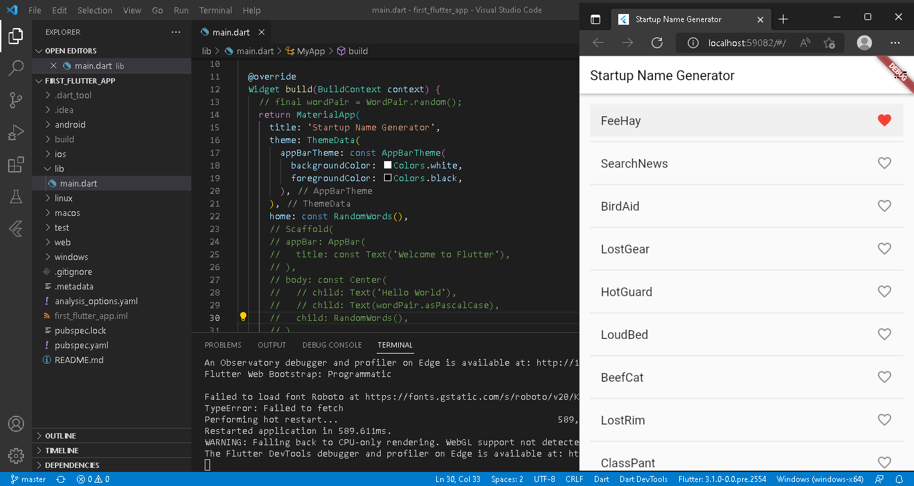

# first_flutter_app

SILVIA NUR MAHMUDAH

## Part 1
Create the starter Flutter app

Use an external package

Add a stateful widget

Create an infinite scrolling Listview

## Part 1
Add icons to the list

Add interactivity

Navigate to a new screen

Change the UI using themes
